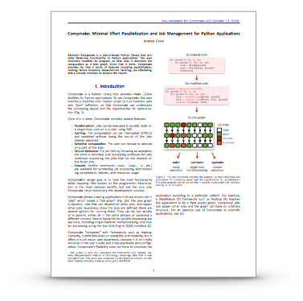

Compmake: you need it but you don't know it yet
===============================================

**Compmake** is a non-obtrusive module that provides Make--like facilities to a Python applciation, including:

- Minimal effort **parallelization** (multiple CPU on a single host, 
cluster computing using SGE, and experimental support for cloud computing using Multyvac).
- **Caching** of temporary results: you can interrupt your program 
and restart it without losing what was already computed.
- **Failure tolerance**: if a job fails, other jobs that do
not depend on it continue to be executed.
- A **console** for inspecting failures and partial completion,
with familiar commands such as ``make``, ``clean``, etc.

Please see the manual at:

http://purl.org/censi/compmake-manual

Screencasts
---------------------------------

Some animations of the job graph
---------------------------------

*Robustness to job failure*

*Simple dynamic jobs*

*Dynamic jobs and recursive parallel executions*

Issues
------

Please report any problem using Github's issue tracker at

   http://github.com/AndreaCensi/compmake/issues

Changelog
---------

* v3.4.0 - Changed the way that dynamic job IDs are generated 
           to avoid a race condition in a corner case.
* v3.3.7 - Bug fix.
* v3.3.6 - Experimental Multyvac backend.

Acknowledgements
----------------

Your tax dollars at work! Compmake development was supported 
by the [National Science Foundation](http://www.nsf.gov/)
in the *National Robotics Initiative* program under grant #1405259.

