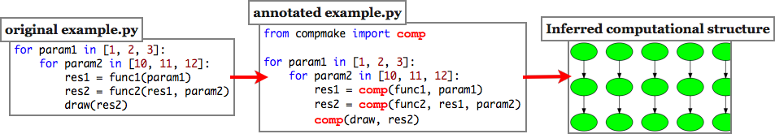

Compmake
=========

.. raw:: html
   :file: fork.html

.. image:: workers.jpg
   :align: right

``compmake`` is ``make`` for batch python processes. 
It is a non-obtrusive module that provides:

* ``make``--like facilities to your computations (``make``, ``clean``, etc.),
  including caching of temporary results. That is you can do a CTRL+C, play your
  videogame, and then restart compmake without losing data.
* Single-host parallelization (using the ``multiprocessing`` module).
* Multiple-host parallelization (using ssh-spawned slaves).

To use compmake, you have to minimally modify your Python program,
such that compmake can understand the processing layout and
the opportunities for parallelization.

That's it. After that, you are ready to run your computation using::

    $ compmake example make       # runs locally
    $ compmake example parmake    # runs locally in parallel
    $ compmake example clustmake  # runs on a cluster

Moreover, by running ``compmake example`` only, you have access to a
console that allows you to inspect the status of the computations,
cleaning/remaking jobs, etc.

Compmake has been designed primarily for handling long computational-intensive
batch processes. It assumes that the computational layout is fixed and that 
all intermediate results can be cached to disk. If these two conditions are met,
you can use compmake to gain considerable peace of mind.

Still interested? Please read along:

.. container:: col1

	**Getting started**

	* :ref:`install`
	* :ref:`features`

	**Tutorial**

	* :ref:`tutorial0`
	* :ref:`tutorial1`
	* :ref:`tutorial2`
	* :ref:`tutorial3`
	* :ref:`tutorial4`

.. container:: col2

	**Advanced usage**

	* :ref:`advanced0`
	* :ref:`advanced1`

	**Reference**

	* :ref:`commands`
	* :ref:`config`

	**Developer**

	* :ref:`developer`
	* :ref:`extending`

.. raw:: html

   

Quick installation
------------------

The quick install is::

$ easy_install compmake

This will allow you to run ``compmake`` on a single host.
However, there are also separate dependencies to install for some
advanced features. See install.rst__ for more information.

Source download
---------------

.. raw:: html
   :file: download.html

Feedback
---------

Compmake is currently developed by Andrea Censi. Contributors are most welcome.

Please use the `issue tracker on github`_ for bugs and requested features.

.. _`issue tracker on github`: https://github.com/AndreaCensi/compmake/issues

Complete documentation table of contents
----------------------------------------

.. toctree::
   :glob:

   install*
   features*
   tutorial*
   advanced*
   config*
   commands*
   *

