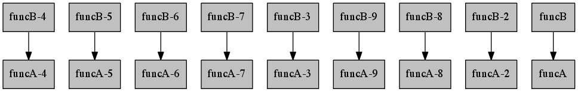

.. include:: definitions.txt

.. contents::
   :class: pagetoc

.. _tutorial_basic:

Basic Compmake usage
====================

This tutorial gives some motivation for using |compmake| and explains the basic usage.
If you don't know *why* you should use |compmake|, read :ref:`why`.

.. _preparing:

Preparing your programs for  compmake
-----------------------------------------

The basic idea is that now your source code will just *describe* your computation, without actually
executing it. 

In practice, to use |compmake|, you have to modify 
each function call of interest by wrapping it with the ``comp()`` function.
It's easy: each fragment of the form::

   result = func1(params1)

becomes::

   result = comp(func1, params1)

The function ``comp()`` does not actually run the computation ``func1(param1)``, but rather it
puts this "job" in the job database. It returns (immediately) a `promise`_ representing
the delayed result. You can use this value in successive calls to ``comp()`` (but not directly).
In this way, |compmake| learns the computational structure of your program.

.. _`promise`: http://en.wikipedia.org/wiki/Promise_%28programming%29

For example, consider the source code:

.. literalinclude:: my_static/example1/original.py

In this example, the source code becomes (file ``using_compmake.py``):

.. literalinclude:: my_static/example1/using_compmake1.py

When this file is passed to |compmake|, the following computational structure
is created:

(This is the output of the `graph command`_)

The next section shows how to run |compmake| once you have modified your source code.

.. _`graph command`: commands.html

Using the console
-----------------

Running the program above will give you a prompt::

  $ python using_compmake1.py 
  Welcome to the compmake console. (write 'help' for a list of commands)
  27 jobs loaded.
  @:

This is Compmake's console prompt.

**Listing jobs**: The command ``ls`` gives a list of the jobs: ::
  
  @: ls
        draw        todo
        draw-2      todo
        draw-3      todo
        draw-4      todo
        draw-5      todo
        ...

**Making**: The command ``make [jobs]`` runs the computation in series: ::

	@: make

The first time you run this, you will see the names of the jobs being executed scrolling by. However, the second time, the output will be something like: ::

	Nothing to do.

because |compmake| has cached the results of the computation.

After making, use ``ls`` to see the results: ::

  @: ls
        draw        todo
        draw-2      todo
        draw-3      todo
        draw-4      todo
        draw-5      todo
        ...

**Cleaning up**: Use the command ``clean`` to clean::

	@: clean

Moreover, the command ``remake`` is equivalent to ``clean`` + ``make``.

**Making in parallel**: The command ``parmake`` runs the computation in parallel: ::

  @: parmake

You can give the number of parallel processes: ::

  @: parmake n=5

**Making in parallel using SGE**: The command ``sgemake`` runs the computation using SGE: ::

  @: sgemake

Naming jobs
-----------

Each invocation of the ``comp()`` function produces one *job*. 
Each job is described by a unique ID. By default, the ID is generated
by the name of the function, with a progressive number postponed. 
You can use the command ``list`` to obtain a list of the jobs.
For this example, the output would be:

.. literalinclude:: my_static/example1/using_compmake1_list_before.txt

As you can see, the jobs are named ``func1-<n>``, ``func2-<n>``,
``draw-<n>``. 

It is very useful to have distinctive names for the jobs. Compmake provides
two mechanisms to that effect. The first is the function ``comp_prefix()``
which takes a string used as a prefix for the job ids generated.
That command is particularly useful in scenarios like the example
where we presumably want to group the functions by the parameters:

.. literalinclude:: my_static/example1/using_compmake2.py

Now the ``list`` command gives:

.. literalinclude:: my_static/example1/using_compmake2_list_before.txt

Another method  is using the ``job_id`` keyword argument to ``comp()``.:

.. literalinclude:: my_static/example1/using_compmake3.py

Now the ``list`` command gives:

.. literalinclude:: my_static/example1/using_compmake3_list_before.txt

Cleaning and remaking
---------------------

Now that you know how to give names to your jobs, you can
use them for referring to them. For example::

    @: make p1=1,p2=11-drawing

You can use the ``*`` wildcard. This is very useful to refer
only to part of the jobs. In the example, you can write::

    @: remake   *-p2=11-*

to re-do only the subset of computations with a certain value 
of the parameters. Or, you can remake the last stage of the computation::

    @: remake   *-drawing

As you can see, compmake gives you peace of mind and a sense of empowerment.

* Go on to the next chapter :ref:`tutorial_console`.
