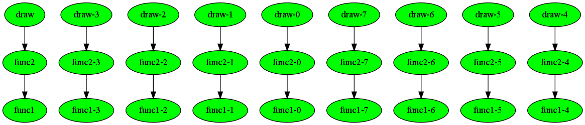

.. _tutorial0:

Basic compmake usage
========================

Suppose that you have the typical program ``original.py`` (:download:`download example  <example1/original.py>`).

.. literalinclude:: example1/original.py

Compmake was developed to deal with programs like this one,
where each of the functions ``f1``,``f2`` take lots of computation
time.  You probably

To use ``compmake``, modify each function call of interest by wrapping it with the ``comp()`` function.
It's easy: each fragment of the form::

   result = func1(params1)

becomes::

   result = comp(func1, params1)

In this example, the source code becomes (file ``using_compmake.py``):

.. literalinclude:: example1/using_compmake1.py
	
This is all you have to do to take advantage of ``compmake``. 
Now, instead of running your program as::

	$ python original.py

use the syntax::

	$ compmake [MODULE] [COMMAND]

The following are some examples.

Running the computation
-----------------------

The command "make [jobs]" runs the computation in series::

	$ compmake example make

You can run a specified job by adding it on the command line::

	$ compmake example make func1\*

You can also the wildcard ``*`` to select multiple jobs.

Cleaning up
-----------

Use the command ``clean [jobs]`` to clean::

	$ compmake my_program clean 

Diagnostics
-----------

The command "list" shows a list of the jobs with relative status.
If you run ::

	$ compmake example list 

before running ``make``, you will see an output similar to this:

.. literalinclude:: example1/list_before.txt

After running ``make``, the output will be:

.. literalinclude:: example1/list_after.txt

Prettier diagnostics
--------------------

There is a command "graph" that can produce a graphical depiction of the computation.
(to use this feature, you should have installed ``graphviz`` and the ``gvgen`` library)

If you run::

$ compmake my_program diagram

before running ``make`` you will see the following:

.. image:: example1/graph_before.png
   :width: 100%
   
The color grey means that the job has not started. After running ``make``, the output will be:

Here, green means that the job is done.

After we run 

.. image:: example1/graph3.png
   :width: 100%

Here, green means that the job is done.

The computation gra

